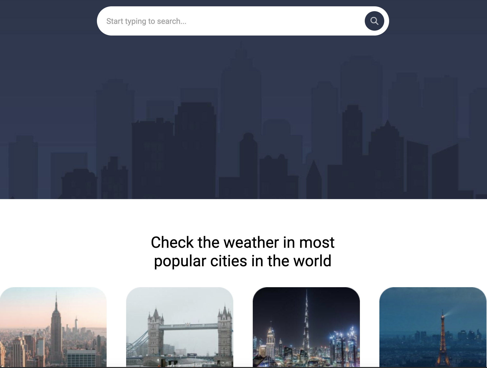

# WeatherApp
## Contents
* [About] (#about)
* [Technologies] (#technologies)
* [Key features] (#key-features)
* [Setup] (#setup)
## About
```
A weather app using OpenWeather APIs to provide current and forecasted weather data. WeatherApp tells users what weather they should expect for different locations.
```
## Technologies
This project was created with:
* HTML
* SCSS
* JavaScript
* OpenWeather APIs

## Key features
With WeatherApp, users can:
* Search for the minimum/maximum temperature across different locations
* Check the current weather across the 4 most popular cities in the world (New York, London, Dubai, and Paris)
* Check out FAQs
* Enjoy day/night modes
## Setup
To run this project, download and extract the WeatherApp file. Then, click index.html.
